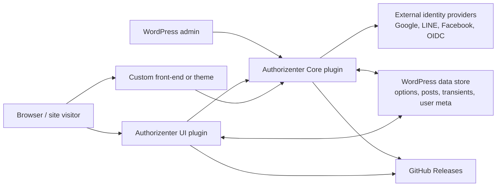
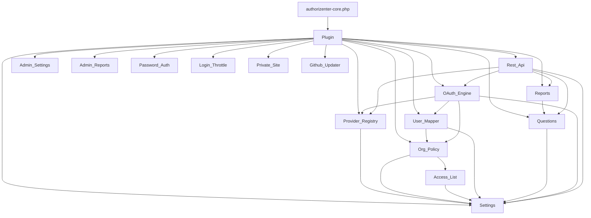
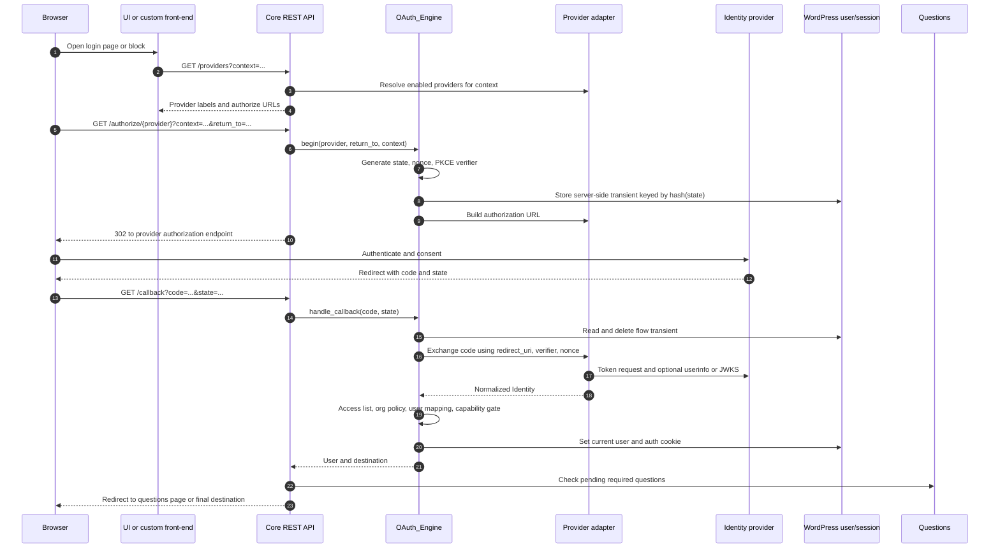
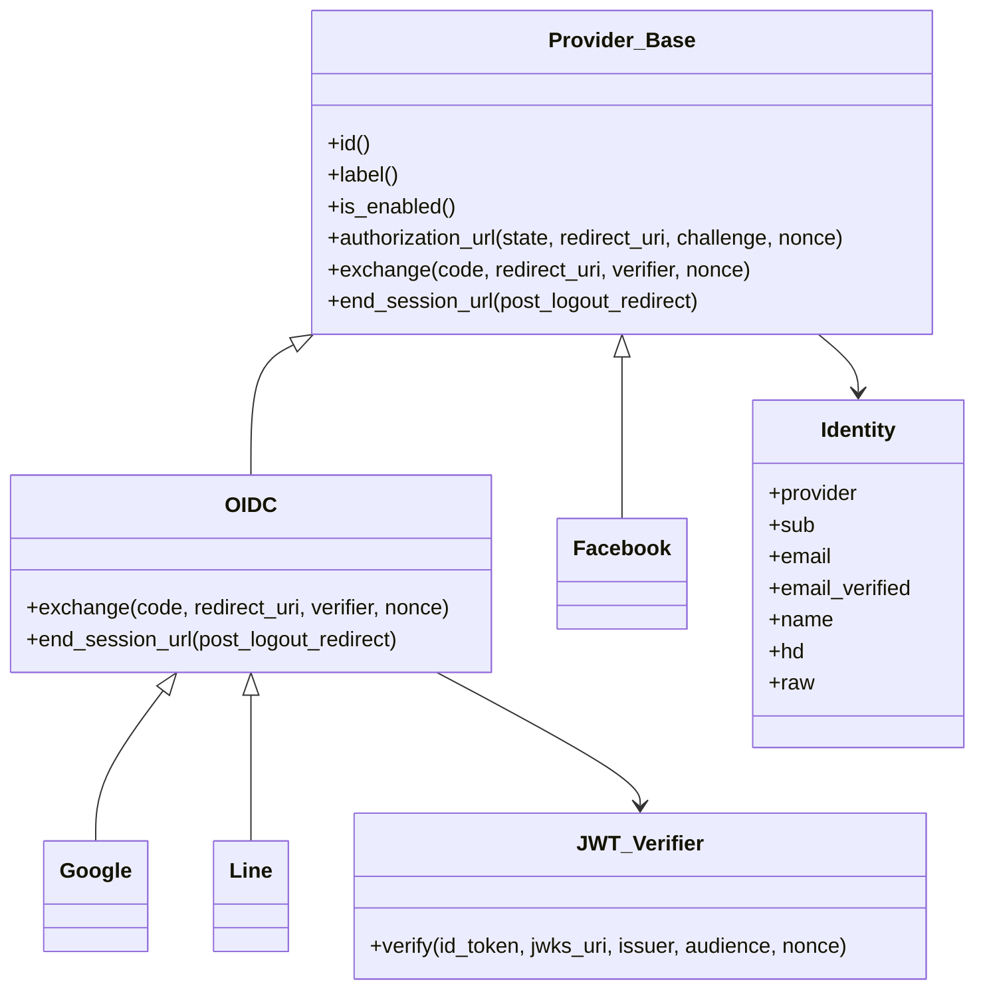
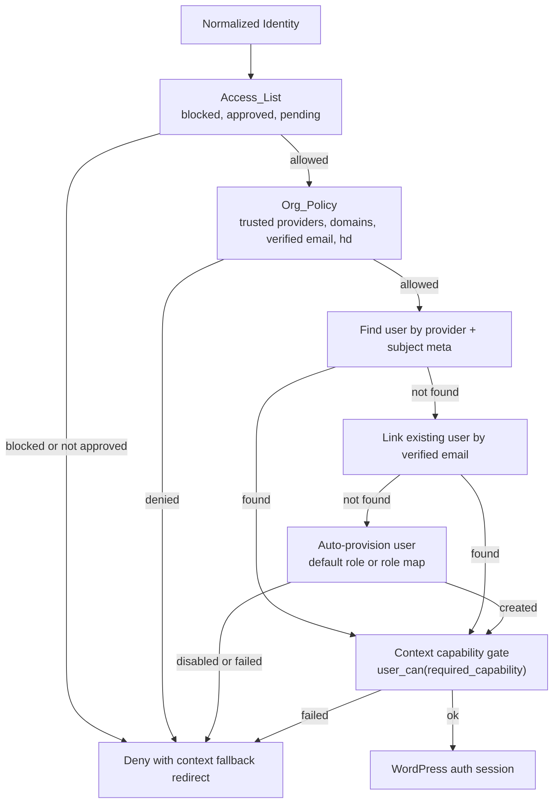
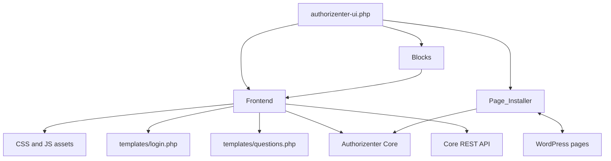
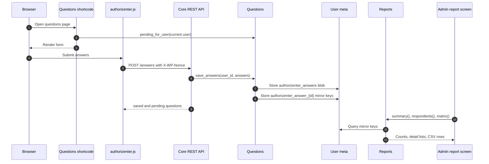
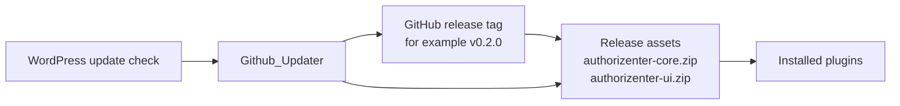

# Authorizenter Architecture

Authorizenter is a WordPress monorepo that ships two plugins:

- `plugins/authorizenter-core`: the security-critical authentication engine, settings store, provider adapters, REST API, access policy, user mapping, post-login questions, reports, admin screens, and GitHub release updater.
- `plugins/authorizenter-ui`: an optional front-end layer with login/logout shortcodes, dynamic blocks, auto-created pages, question forms, and assets. It depends on Core and contains no OAuth exchange or policy logic.

The main architectural rule is that Core owns the authentication contract. UI, custom themes, React apps, Elementor pages, or other integrations should consume Core through its REST API, helper functions, and documented action/filter hooks.

## Repository Layout

```text
.
|-- plugins/
|   |-- authorizenter-core/
|   |   |-- authorizenter-core.php
|   |   |-- includes/
|   |   |-- includes/providers/
|   |   |-- languages/
|   |   `-- readme.txt
|   `-- authorizenter-ui/
|       |-- authorizenter-ui.php
|       |-- includes/
|       |-- templates/
|       |-- assets/
|       |-- blocks/
|       |-- languages/
|       `-- readme.txt
|-- docs/
|   |-- hooks.md
|   `-- providers.md
|-- tests/
|-- composer.json
|-- phpcs.xml.dist
`-- phpunit.xml.dist
```

## System Topology



Core exposes REST routes under `authorizenter/v1`, WordPress hooks for extension, and `Authorizenter\Core\authorizenter_core()` for PHP integrations. The UI plugin renders Core-backed shortcodes and blocks, creates pages for configured login contexts, and posts question answers back to Core through REST.

## Core Runtime Object Graph

`plugins/authorizenter-core/authorizenter-core.php` registers a lightweight namespace autoloader, loads Composer dependencies from either the plugin or monorepo root, and boots `Authorizenter\Core\Plugin` on `plugins_loaded`.



Key responsibilities:

- `Settings` reads and writes the single `authorizenter_settings` option, merges defaults, resolves login contexts, and encrypts provider secrets using WordPress salts when OpenSSL is available.
- `Provider_Registry` maps provider ids to provider adapter classes and filters the class map through `authorizenter_provider_classes`.
- `OAuth_Engine` owns Authorization Code + PKCE flow orchestration, state/nonce storage, callback handling, policy checks, user resolution, capability checks, session creation, and logout.
- `Org_Policy` enforces access lists, trusted providers, email-domain rules, verified-email requirements, Google `hd` checks, and context capability gates.
- `User_Mapper` links identities to WordPress users by provider subject or verified email, then auto-provisions users when allowed.
- `Questions` validates question definitions and answers, stores full answer blobs, and writes per-question mirror meta keys for reporting.
- `Reports` reads question answer mirror meta and builds summaries, respondent lists, and CSV export matrices.
- `Rest_Api` registers the public login routes and authenticated question/report routes.
- `Password_Auth`, `Login_Throttle`, and `Private_Site` add optional login-hardening behavior around WordPress' native login and front-end access.

## Authentication Flow

All providers share one callback URL:

```text
https://YOUR-SITE/wp-json/authorizenter/v1/callback
```



Important security boundaries:

- The callback derives provider, context, nonce, PKCE verifier, and `return_to` from the transient created during `/authorize`; it does not trust those values from the callback query string.
- Flow state is single-use. `OAuth_Engine` deletes the transient as soon as the callback consumes it.
- OIDC `id_token` verification is delegated to `JWT_Verifier`, which uses `firebase/php-jwt`, provider JWKS, issuer, audience, and nonce checks. If the JWT library is unavailable, verification fails closed.
- Generic OIDC discovery must use HTTPS except for local development hosts.
- Post-login redirects are constrained through WordPress safe redirect validation.

## Provider Model



Built-in providers are:

- `google`: OIDC preset with Google's discovery document and `openid email profile` scopes. Preserves the Google Workspace `hd` claim.
- `line`: OIDC preset using LINE discovery and `openid profile email` scopes. Email may be absent unless the LINE channel has email permission and user consent.
- `facebook`: OAuth2 + Graph API provider. Facebook email is treated as unverified because there is no standard verified-email claim.
- `oidc`: generic OIDC provider for Azure AD / Entra ID, Keycloak, Okta, Auth0, university SSO, and other compliant IdPs.

Custom providers extend `Provider_Base` or `Providers\OIDC` and are registered with the `authorizenter_provider_classes` filter.

## Policy And User Mapping



Access lists apply before organization policy. Blocked entries are always denied, even if organization policy enforcement is disabled. When approved-list enforcement is enabled, unapproved emails are recorded as pending for admin review.

Login contexts are resolved by `Settings::get_context()`. A context can restrict visible providers, override organization policy and provisioning settings, require a capability such as `manage_options`, define success and deny redirects, and choose a subset of questions.

## REST API

Core registers routes in the `authorizenter/v1` namespace.

| Method | Route | Auth | Responsibility |
| --- | --- | --- | --- |
| `GET` | `/providers?context=` | Public | Lists enabled providers available in a context and their authorize URLs. |
| `GET` | `/authorize/{provider}?context=&return_to=` | Public | Starts the OAuth flow and redirects to the provider. |
| `GET` | `/callback` | Public | Completes provider callback, logs the user in, and redirects. |
| `GET` | `/logout?return_to=` | Public | Logs out locally and optionally redirects through an OIDC end-session endpoint. |
| `GET` | `/questions` | Logged-in | Returns pending questions and a REST nonce. |
| `POST` | `/answers` | Logged-in, nonce | Validates and saves answers for the current user. |
| `GET` | `/answers/report` | `list_users` | Returns aggregate question-answer reports. |

The complete extension contract is documented in `docs/hooks.md`.

## UI Plugin

`plugins/authorizenter-ui/authorizenter-ui.php` boots after Core. If Core is missing, it shows an admin notice and does not register front-end behavior.



UI behavior:

- `[authorizenter_login]` renders provider buttons for a resolved context.
- `[authorizenter_logout]` renders a logout link to Core's REST logout endpoint.
- `[authorizenter_questions]` renders pending question inputs and enqueues `assets/authorizenter.js`.
- The JavaScript submits answers to `POST /wp-json/authorizenter/v1/answers` with the WordPress REST nonce.
- Dynamic blocks `authorizenter/login` and `authorizenter/logout` server-render through the same shortcodes, keeping markup in one path.
- `Page_Installer` creates a questions page and one login page per configured context, stores their page ids in WordPress options, and leaves pages in place on deactivation.
- UI supplies Core with login and questions URLs through filters so Core can redirect users to the right front-end pages.

## Question And Reporting Data Flow



Answers are stored twice:

- `authorizenter_answers`: one user-meta array holding the full answer map.
- `authorizenter_answer_{id}`: one scalar mirror key per question, allowing reports and user queries to use indexed meta lookups instead of scanning serialized blobs.

## Data Stores

| Storage | Keys / objects | Owner | Purpose |
| --- | --- | --- | --- |
| WordPress option | `authorizenter_settings` | Core `Settings` | Provider config, encrypted secrets, policy, users, access lists, throttle, private-site mode, questions, contexts, advanced settings. |
| WordPress options | `authorizenter_login_page_id`, `authorizenter_questions_page_id`, `authorizenter_context_pages` | UI `Page_Installer` | Tracks auto-created front-end pages. |
| Transients | `authorizenter_flow_{sha256(state)}` | Core `OAuth_Engine` | Short-lived OAuth flow state with provider, context, nonce, PKCE verifier, and safe return URL. |
| Transients | `authorizenter_oidc_disc_*`, `authorizenter_jwks_*` | OIDC / `JWT_Verifier` | Caches OIDC discovery documents and JWKS responses. |
| Transients | `authorizenter_lockout_*` | `Login_Throttle` | Tracks failed password-login attempts per client IP. |
| Transients | `authorizenter_gh_*` | `Github_Updater` | Caches GitHub latest-release responses. |
| User meta | `authorizenter_link_{provider}` | `User_Mapper` | Links a WordPress user to a provider subject id. |
| User meta | `authorizenter_last_provider` | `OAuth_Engine` | Remembers the last SSO provider for optional RP-initiated logout. |
| User meta | `authorizenter_answers`, `authorizenter_answer_{id}` | `Questions` | Stores post-login question answers and report-friendly mirrors. |
| Posts | Published pages | UI `Page_Installer` | Holds generated login and question shortcodes. |

## Extension Points

The primary extension points are WordPress actions and filters. Common examples:

- Add providers with `authorizenter_provider_classes`.
- Adjust authorization query args with `authorizenter_authorization_args`.
- Inspect or modify identities with `authorizenter_identity`.
- Extend domain policy with `authorizenter_allowed_domains` or final allow/deny logic with `authorizenter_is_allowed`.
- Override context resolution and capability decisions with `authorizenter_context` and `authorizenter_context_capability`.
- Customize redirects with `authorizenter_post_login_redirect`, `authorizenter_questions_url`, `authorizenter_login_url`, and `authorizenter_context_login_url`.
- Enable provider SSO logout with `authorizenter_sso_logout`.
- Disable password login programmatically with `authorizenter_disable_password_auth`.
- React to lifecycle events such as `authorizenter_login_success`, `authorizenter_user_provisioned`, `authorizenter_answers_saved`, and `authorizenter_questions_completed`.

Keep new integrations dependent on those contracts instead of reaching into private class internals.

## Security Architecture Notes

- Core is the trust boundary. UI and custom front-ends should only start flows, render provider choices, and collect question answers.
- OAuth flow state is stored server-side and keyed by a hash of an opaque state value.
- PKCE, nonce, and state are generated for every login attempt.
- OIDC tokens are verified against JWKS, issuer, audience, and nonce. Missing JWT support fails closed.
- Account linking by email requires `email_verified`.
- Access lists deny blocked identities before other policy checks.
- Context capability gates use `user_can()` rather than role-name comparisons.
- Provider client secrets are encrypted at rest with AES-256-CBC when OpenSSL and WordPress salts are available; without OpenSSL they are base64-prefixed fallback values and should not be considered encrypted.
- Public REST routes are limited to login entry and callback behavior. Question answer submission requires a logged-in user and REST nonce; reports require `list_users`.
- External redirects are only used for configured provider endpoints and optional IdP logout. Site-local redirects use WordPress safe redirect helpers.

See `SECURITY.md` for the threat model and operational recommendations.

## Release And Update Path

Both plugins can update themselves from GitHub Releases through `Github_Updater`.



The updater expects the configured repository to expose a latest release and prefers a ZIP asset matching each plugin slug. Update checks are cached for six hours. Private repositories or higher API rate limits can be supported through the `authorizenter_github_request_args` filter.

## Development And Verification

Composer is used for both runtime and development dependencies:

- Runtime: PHP `>=8.0`, WordPress `>=6.0`, and `firebase/php-jwt`.
- Static checks: `composer lint`.
- Auto-formatting: `composer lint:fix`.
- PHPUnit tests: `composer test`.
- PHP syntax checks: `composer syntax`.

The test suite uses WordPress stubs in `tests/wp-stubs.php` and focuses on Core behavior such as provider registration, OAuth flow handling, PKCE, settings, policy, access lists, throttling, questions, reports, user mapping, and updater logic.
